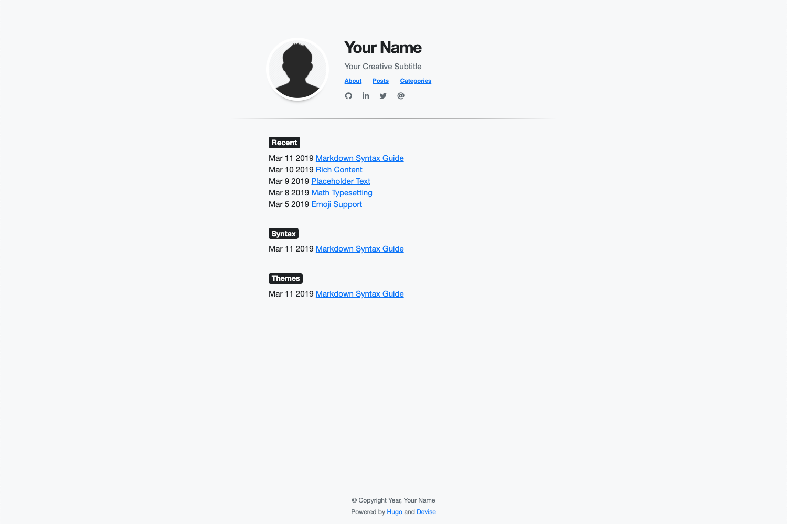

# Devise

A fast and minimal [Hugo](https://gohugo.io/) theme for blogs.



## Installation

- Hugo Version [0.60.0+](https://github.com/gohugoio/hugo/releases/)

From the root of your Hugo site, run the following:

```
$ git submodule add https://github.com/austingebauer/devise.git themes/devise
$ git submodule init
$ git submodule update
```

## Updates

You can get updates to the Devise theme by running: 

```
$ git submodule update --remote themes/devise
```

## Configuration

TODO
